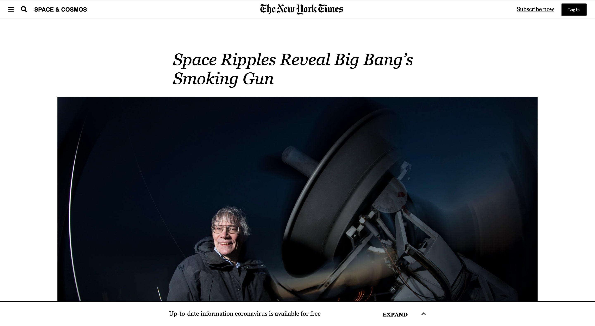
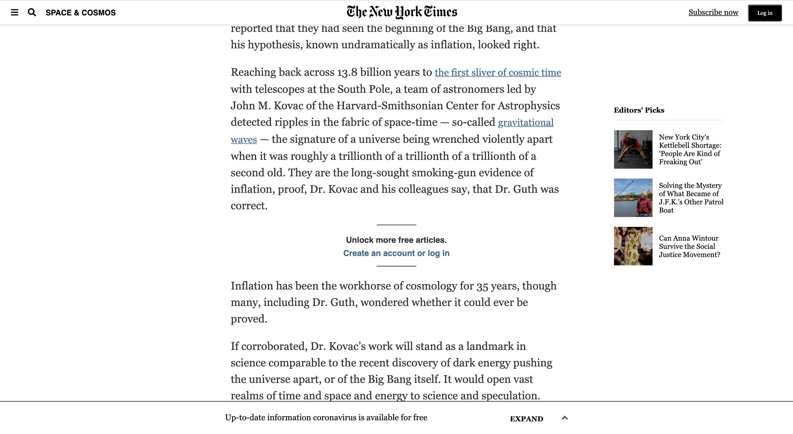
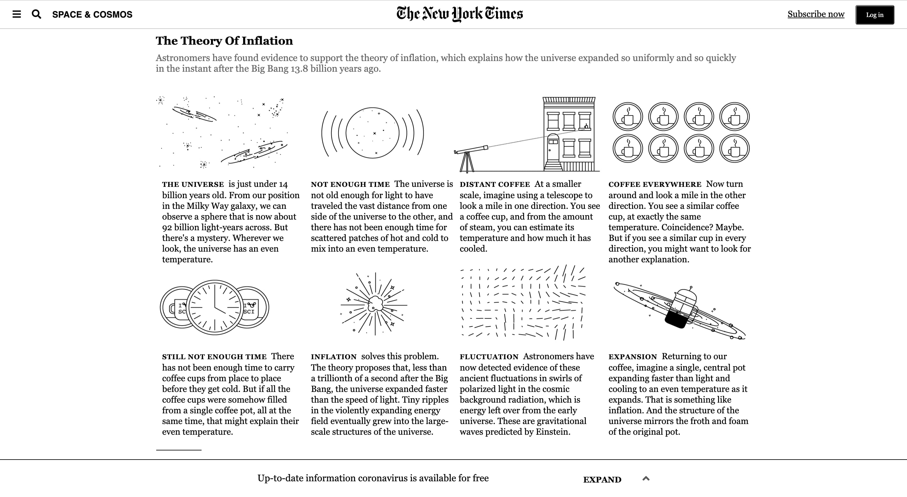
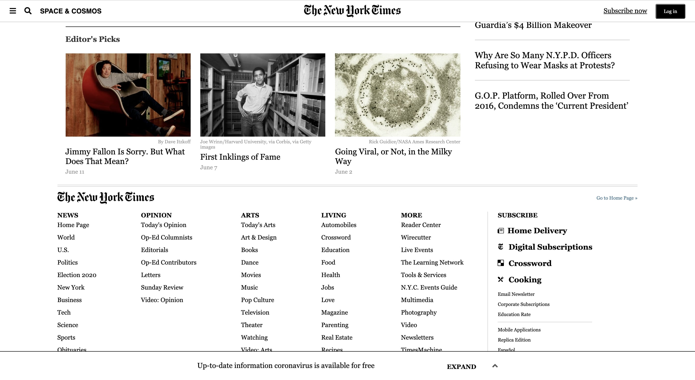

# Project: Embedding Images and Video
> This project is a clone of an article by the New York Times on the discovery of inflation, a scientific theory first proposed by physicist Alan Guth.

​
## Live Demo 🔴
[Live Demo Link](https://boring-nightingale-71924c.netlify.app/)

## Built With
- HTML
- CSS
- VS Code
- W3 HTML Validator
- Stickler 
- Font Awesome
- Google Chrome
​
## Getting Started
**To view this project in its entirety, download this repository from GitHub to your local hard drive. Then, simply open the index.html file using your browser of preference.**
​
### Prerequisites
A computer.
A browser of preference.
​
## Authors
​
👤 **Joe Burke**
​
- Github: [@Joseph-Burke](https://github.com/Joseph-Burke)
- Twitter: [@__joeburke](https://twitter.com/__joeburke)
- Linkedin: [Joe Burke](https://www.linkedin.com/in/joseph-burke-b7a8261a5/)
- E-mail: joseph_burke@outlook.com

👤 **Amita Roy**
​
- Github: [@Amita-Roy](https://github.com/Amita-Roy)
- Twitter: [@AmitaRoy14](https://twitter.com/AmitaRoy14)
- Linkedin: [Amita Roy](https://www.linkedin.com/in/amita-roy-3b823b68/)
- E-mail: amita.roy@workmail.com
​
## �� Contributing
​
Feedback is always appreciated! Help us by adding an issue.
​
## Show your support
​
Give a ⭐️ if you like this project! Follow us for our future projects.
​
## Acknowledgments
- Thanks to New York Times for a nicely designed website.
- Thanks to Microverse, The Odin Project and all the other amazing educational resources out there for teaching us how to make stuff like this.
​
## �� License
​
This project is [MIT](lic.url) licensed.